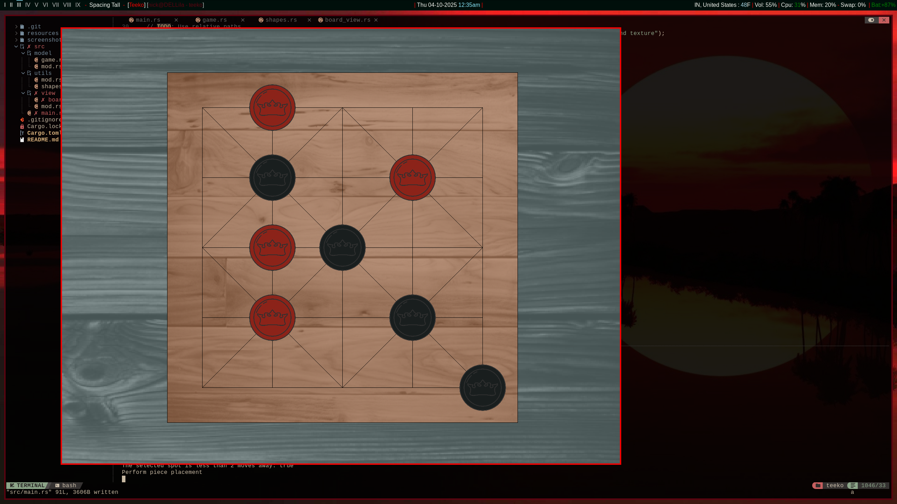

# Teeko - Rust Implementation

This is my very first rust project! It is an implementation of the teeko strategy game using SDL media library.

## Current look

## Reference - GetIntoGameDev

I am semi-loosely following the guidance of a tutorial series on youtube. If you're also interested in learning some Rust but not interested in rehashing the old console applications you've made in other languages, check out this series: https://www.youtube.com/playlist?list=PLn3eTxaOtL2M-VkAeqk0p3Xn7byveJ9qX

